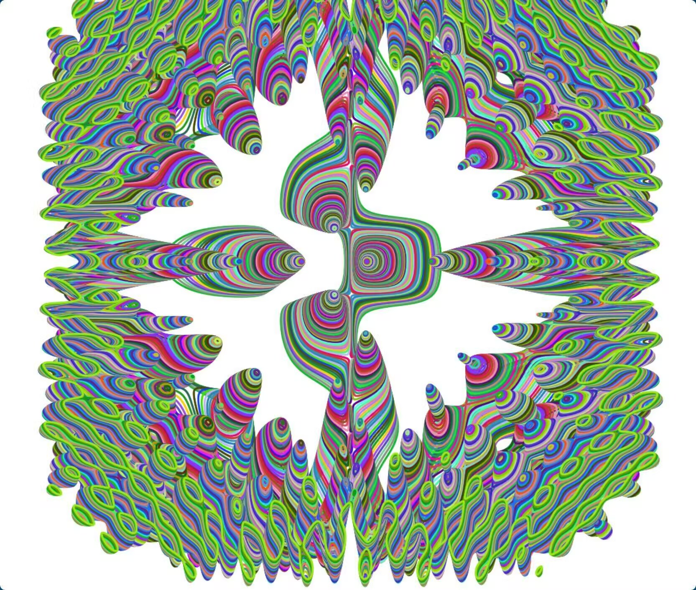
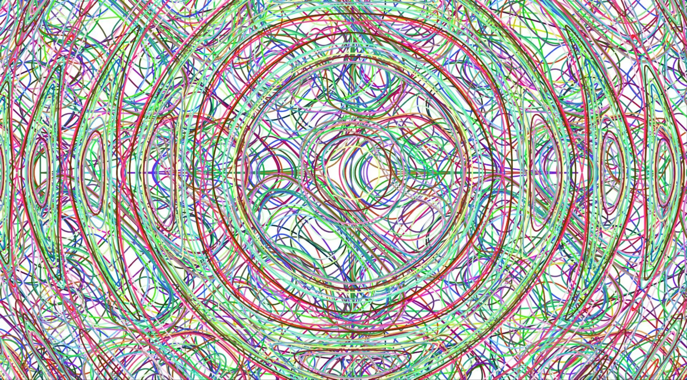
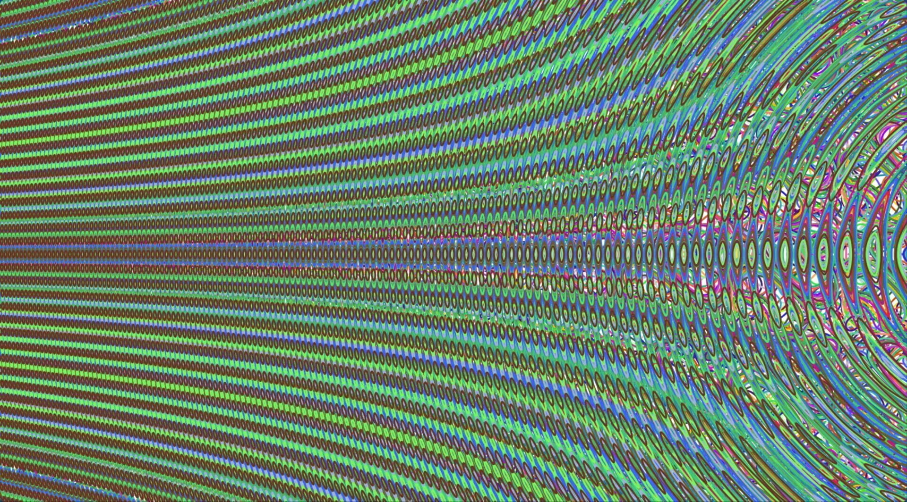
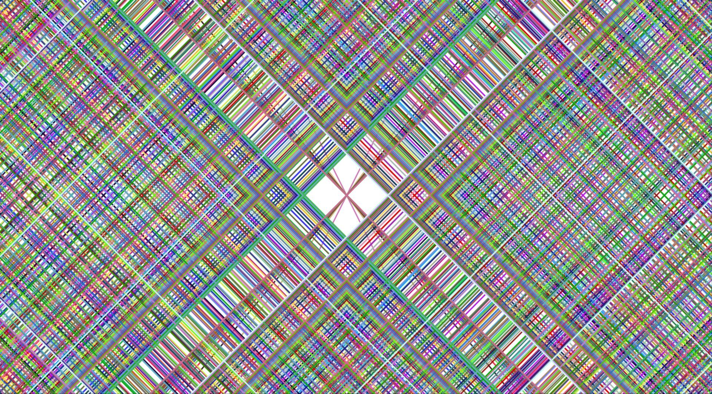
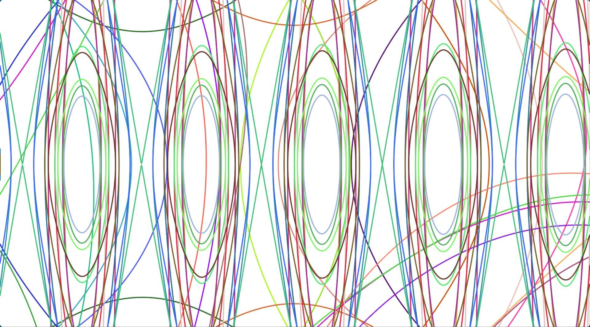
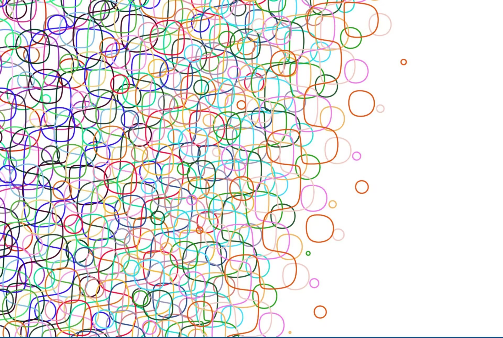

# StuCanvas

现代化 Web 端跨平台实时函数绘制与几何图形构建应用。

## 简介

**StuCanvas** 专为 Web 平台设计的现代化、高性能几何绘图应用。旨在解决浏览器端处理大规模动态几何关系时的性能瓶颈，利用 C++ 和 现代化图形API 。

## 特性

*   **混合渲染算法**：混合 **区间算术 (Interval Arithmetic)** & **行进网格法 (Marching Squares)**，加速渲染&保持精度。
*   **特殊抗锯齿技术**：针对“点图元”设计的抗锯齿方案，高性能高精度。
*   **任意精度支持**：底层默认采用 `Double` 精度，并支持通过扩展实现 **任意精度浮点运算**，彻底消除微观缩放下的浮点漂移。

## 依赖库 

StuCanvas 集成以下 C++ 库：

库 | 用途
-------|-----------------------------------------------------
[oneTBB](https://github.com/oneapi-src/oneTBB) | 并行计算，多线程计算。
[xsimd](https://github.com/xtensor-stack/xsimd) | SIMD向量化，计算加速。
[Boost.Multiprecision](https://github.com/boostorg/multiprecision) | 任意精度计算前端。
[GMP](https://gmplib.org/) | 任意精度计算。
[simdjson](https://github.com/simdjson/simdjson) | JSON解析。
[nlohmann/json](https://github.com/nlohmann/json) | JSON解析。

### 运行环境
由于利用了前沿的 Web 图形 API，运行环境需满足：

组件 | 要求
-----|-------------------------------
浏览器 | 支持 **WebGPU** , **Web Assembly**的 **Chromium**,**Safari**,**FireFox** 浏览器

## 效果

复合函数算法算法，精准处理各类复杂的几何关系与极端函数形态。

<table>
  <tr>
    <td align="center"> 隐函数</td>
    <td align="center"> 隐函数</td>
    <td align="center"> 1000隐函数圆</td>
    <td align="center"> 隐函数</td>
  </tr>
  <tr>
    <td align="center"> 直线</td>
    <td align="center"> 曲线细节</td>
    <td align="center"> 万花筒</td>
    <td align="center"> 曲线细节</td>
  </tr>
</table>

### 实时交互演示

CPU | U9 275hHx

<table>
  <tr>
    <td align="center">
      <video src="./docs/videos/1.mp4" width="300px" controls>您的浏览器不支持视频播放</video> 
      StuCanvas实时绘制100个复杂隐函数
    </td>
    <td align="center">
      <video src="./docs/videos/2.mp4" width="300px" controls>您的浏览器不支持视频播放</video> 
      Desmos实时绘制50个y^3=sin(10x)
    </td>
  </tr>
</table>

## 应用与集成

### StuWiki
本项目作为 **StuWiki** 网站的官方底层图形驱动。Wiki 条目能够承载动态、交互式的几何模型，为用户提供直观的数学视觉化体验。

### 🚀 渲染引擎压力测试对比 (Stress Test Benchmark)

| 数学公式 (Formula) | 压力点描述 (Stress Point) | Stu(性能) | Stu(精度) | Desmos | GeoGebra | Mma | Maple | MatLab | GrafEq |
| :--- | :--- | :---: | :---: | :---: | :---: | :---: | :---: | :---: | :---: |
| $y^3 = \sin(x + 9\dots9)$ | $f64$ 高精偏移锯齿测试 | $\color{green}{\checkmark}$ | $\color{green}{\checkmark}$ | $\color{red}{\times}$ | $\color{red}{\times}$ | $\color{orange}{?}$ | $\color{orange}{?}$ | $\color{orange}{?}$ | $\color{orange}{?}$ |
| $y^3 = x^{1000000}$ | 极高幂次溢出与图像断裂 | $\color{green}{\checkmark}$ | $\color{green}{\checkmark}$ | $\color{red}{\times}$ | $\color{red}{\times}$ | $\color{orange}{?}$ | $\color{orange}{?}$ | $\color{orange}{?}$ | $\color{orange}{?}$ |
| $y^3 = \sin(\frac{1}{x})$ | $x=0$ 处 NaN 逻辑稳定性 | $\color{green}{\checkmark}$ | $\color{green}{\checkmark}$ | $\color{red}{\times}$ | $\color{red}{\times}$ | $\color{orange}{?}$ | $\color{orange}{?}$ | $\color{orange}{?}$ | $\color{orange}{?}$ |
| $y^3 = \tan(\frac{1}{x})$ | 中心极高频区域采样策略 | $\color{green}{\checkmark}$ | $\color{green}{\checkmark}$ | $\color{red}{\times}$ | $\color{red}{\times}$ | $\color{orange}{?}$ | $\color{orange}{?}$ | $\color{orange}{?}$ | $\color{orange}{?}$ |
| $y^3 = \sin(99999x)$ | 高频摩尔纹与点采样缺失 | $\color{green}{\checkmark}$ | $\color{green}{\checkmark}$ | $\color{red}{\times}$ | $\color{red}{\times}$ | $\color{orange}{?}$ | $\color{orange}{?}$ | $\color{orange}{?}$ | $\color{orange}{?}$ |
| $\sin(x^2 + y^2) = 0.1$ | 复杂隐函数同心圆连通性 | $\color{green}{\checkmark}$ | $\color{green}{\checkmark}$ | $\color{red}{\times}$ | $\color{red}{\times}$ | $\color{orange}{?}$ | $\color{orange}{?}$ | $\color{orange}{?}$ | $\color{orange}{?}$ |
| $y = 3^x \sin(x)$ | $x>800$ 指数运算鲁棒性 | $\color{green}{\checkmark}$ | $\color{green}{\checkmark}$ | $\color{red}{\times}$ | $\color{red}{\times}$ | $\color{orange}{?}$ | $\color{orange}{?}$ | $\color{orange}{?}$ | $\color{orange}{?}$ |
| $y = \ln(\cos x + \sin y)$ | 隐函数孤立离散细节捕捉 | $\color{green}{\checkmark}$ | $\color{green}{\checkmark}$ | $\color{red}{\times}$ | $\color{red}{\times}$ | $\color{orange}{?}$ | $\color{orange}{?}$ | $\color{orange}{?}$ | $\color{orange}{?}$ |
| $y^3 = \ln(x)$ | 负半轴渐近线深度渲染 | $\color{green}{\checkmark}$ | $\color{green}{\checkmark}$ | $\color{red}{\times}$ | $\color{red}{\times}$ | $\color{orange}{?}$ | $\color{orange}{?}$ | $\color{orange}{?}$ | $\color{orange}{?}$ |
| $y^3 = \tan(x)$ | 奇点 NaN 垂直连线剔除 | $\color{green}{\checkmark}$ | $\color{green}{\checkmark}$ | $\color{red}{\times}$ | $\color{red}{\times}$ | $\color{orange}{?}$ | $\color{orange}{?}$ | $\color{orange}{?}$ | $\color{orange}{?}$ |
| $\sin(x^2+y^2) = 0.999$ | 极窄阈值隐函数采样测试 | $\color{green}{\checkmark}$ | $\color{green}{\checkmark}$ | $\color{red}{\times}$ | $\color{red}{\times}$ | $\color{orange}{?}$ | $\color{orange}{?}$ | $\color{orange}{?}$ | $\color{orange}{?}$ |
| $y^3 = \frac{\ln x}{x-1}$ | 间断点处区间算术平滑度 | $\color{green}{\checkmark}$ | $\color{green}{\checkmark}$ | $\color{red}{\times}$ | $\color{red}{\times}$ | $\color{orange}{?}$ | $\color{orange}{?}$ | $\color{orange}{?}$ | $\color{orange}{?}$ |
| $y^3 = \frac{x^2-4}{x+2}$ | 分式可去间断点逻辑测试 | $\color{green}{\checkmark}$ | $\color{green}{\checkmark}$ | $\color{red}{\times}$ | $\color{red}{\times}$ | $\color{orange}{?}$ | $\color{orange}{?}$ | $\color{orange}{?}$ | $\color{orange}{?}$ |
| $x^{2/3} + y^{2/3} = 1$ | 负数域幂函数解析测试 | $\color{green}{\checkmark}$ | $\color{green}{\checkmark}$ | $\color{red}{\times}$ | $\color{red}{\times}$ | $\color{orange}{?}$ | $\color{orange}{?}$ | $\color{orange}{?}$ | $\color{orange}{?}$ |
| $x^2 + 2x + 1 = 0$ | 临界厚度极细直线渲染 | $\color{green}{\checkmark}$ | $\color{green}{\checkmark}$ | $\color{red}{\times}$ | $\color{red}{\times}$ | $\color{orange}{?}$ | $\color{orange}{?}$ | $\color{orange}{?}$ | $\color{orange}{?}$ |
| $(y+x+1)^2(y+1-x) = 0$ | 复合直线系公式解析检查 | $\color{green}{\checkmark}$ | $\color{green}{\checkmark}$ | $\color{red}{\times}$ | $\color{red}{\times}$ | $\color{orange}{?}$ | $\color{orange}{?}$ | $\color{orange}{?}$ | $\color{orange}{?}$ |
| $y = \frac{\sin(1/x)}{\sin(1/x)}$ | 间断点空心点鲁棒性测试 | $\color{green}{\checkmark}$ | $\color{green}{\checkmark}$ | $\color{red}{\times}$ | $\color{red}{\times}$ | $\color{orange}{?}$ | $\color{orange}{?}$ | $\color{orange}{?}$ | $\color{orange}{?}$ |
| $(\frac{1}{\cos t}, \tan t)$ | 参数方程渐近线断开处理 | $\color{green}{\checkmark}$ | $\color{green}{\checkmark}$ | $\color{red}{\times}$ | $\color{red}{\times}$ | $\color{orange}{?}$ | $\color{orange}{?}$ | $\color{orange}{?}$ | $\color{orange}{?}$ |
----

## 许可证

本项目采用 MIT 许可证。