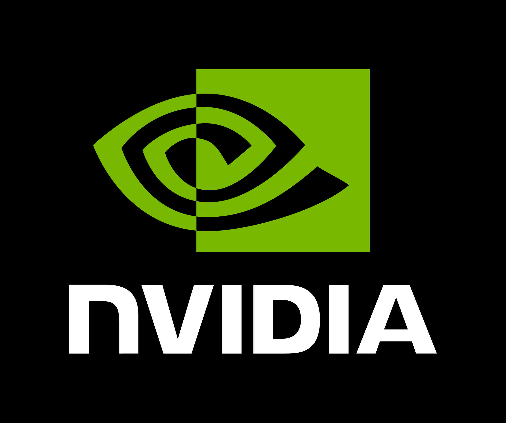

---

# StuCanvas

### 📥 官方网站
**[stucanvas.org](https://stucanvas.org/)**

> **项目状态声明**：目前 StuCanvas 正式版的测试与开发工作即将完毕。开发者已倾注了最大时间和精力，致力于为广大用户提供一个稳定、实用的可视化工具。

---

**StuCanvas** 是一款支持多维可视化的渲染引擎，主要用于数学计算、几何推导、物理模拟展示以及科学传播。

项目在设计上参考了 GeoGebra, Desmos, Algodoo, Manim, GrafEq 等工具的功能特性，利用底层图形接口与系统级语言实现，提供多维交互与视频导出功能。

---

## 🛠 技术栈

* **图形 API**：基于 **Vulkan** 构建渲染管线，实现多线程渲染。
* **开发语言**：采用 **Rust** 与 **C++23** 混合编程，兼顾运行效率与内存管理。
* **窗口与系统交互**：基于 **SDL3** 提供窗口管理与输入事件捕获。
* **文本排版后端**：集成 **Typst** 编译器，支持数学公式与多语言文本的排版输出。

---

## 📋 功能特性

### 1. 函数绘图
* **基础算法**：结合了 **Jeff Tupper 区间算术算法** 与**遗传算法**。
* **边界求解**：针对高频振荡函数、隐函数及奇异点等特殊数学场景进行边界求解与展示。

### 2. 几何约束求解
* **依赖管理**：采用声明式的几何构建逻辑，内部使用拓扑图论算法管理几何体之间的约束与依赖关系。
* **并行加速**：引入多核心 CPU 并行计算，进行几何关系的实时求解。

### 3. 多维图形支持
* **渲染维度**：支持 2D 与 3D 渲染，采用按需加载的设计。
* **SVG 支持**：支持常用的 SVG 规范子集解析与渲染。

### 4. 交互与状态控制
* **预览系统**：支持实时预览与暂停交互，用户在动画播放或模拟运行过程中可以介入交互并恢复。

### 5. 视频导出机制
* **时间轴跳转**：时间轴支持任意帧跳转，便于调试。
* **显存就地编码（In-place VRAM Encoding）**：视频导出时，渲染帧数据直接通过驱动调用显存进行编码，减少 CPU 与 GPU 之间的数据拷贝，支持主流分辨率视频导出。

---

## 🛠️ 第三方依赖列表 (Dependencies)

| 徽标 (Logo) | 依赖项 (Dependency) | 许可协议 (License) | 说明与核心用途 (Description) |
|:---:| :--- | :--- | :--- |
|     | **Vulkan SDK** | Apache 2.0 | 跨平台的图形与计算 API，用于构建渲染管线。 |
|     | **NVIDIA Driver API** | Proprietary | 配合硬件特性实现显存就地编码与视频导出加速。 |
|     | **Intel CPU Tech & TBB** | Apache 2.0 / MIT | 引入 CPU 并行计算，优化图论几何求解与依赖树构建。 |
|     | **Slang Shading Language** | Apache 2.0 | 着色器语言与编译服务，提供跨平台着色器生成与动态管理。 |
|     | **Eigen3** | MPL2 | 线性代数库，用于底层的矩阵变换与几何坐标求解。 |
|     | **SDL3** | zlib | 跨平台底层开发库，提供窗口管理、事件捕获及多媒体上下文环境。 |

---

### 🏷️ 商标与免责声明 (Trademarks & Disclaimers)

* **Intel** 以及 **Intel Inside** 均为 Intel Corporation 及其子公司的注册商标。
* **NVIDIA**、**GeForce** 均为 NVIDIA Corporation 的注册商标。
* **Vulkan** 以及 Vulkan 徽标是 Khronos Group Inc. 的注册商标。
* 本软件中所引用的各品牌 Logo 及注册商标仅用于标示系统底层的技术依赖与兼容性，其知识产权与版权均归属各对应商标持有人所有。